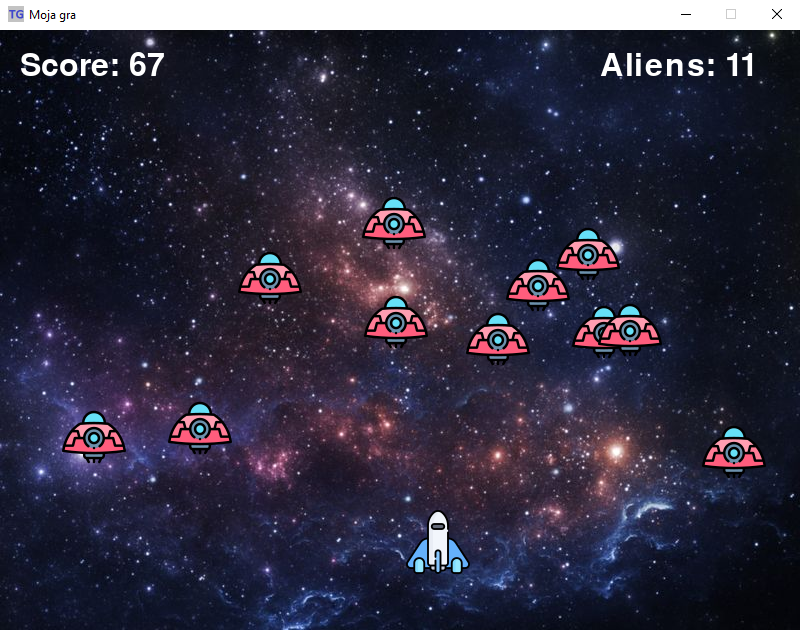

# Space_Invaders
'Space Invaders' is my very first game created in Python with Pygame library.
Survive as long as possible by shooting down alien spaceships!

## Instruction
- To play 'Space Invaders', run the file: _space_invaders_1_0.py_
- Controls: 
  - movement - left and right arrow 
  - shot - space

  

